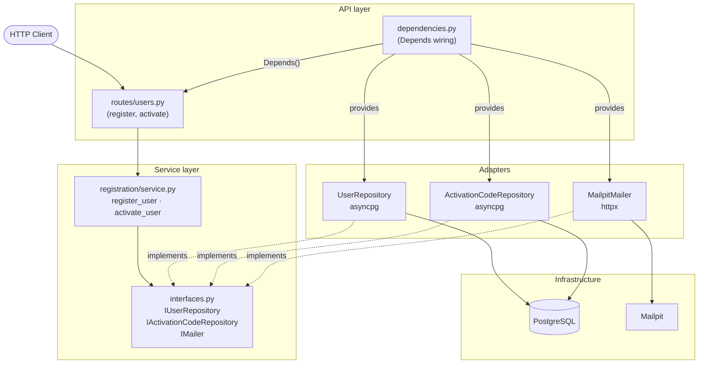
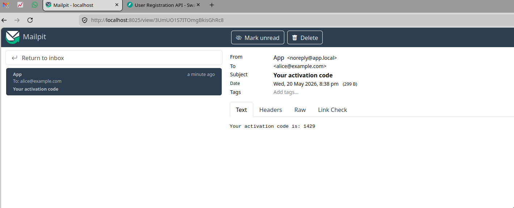

# User Registration API

A small FastAPI service that handles user registration with email-based OTP activation. Users register with an email and password, receive a 4-digit code, and activate their account by submitting that code with HTTP Basic Auth.

Built with Python 3.12, FastAPI, PostgreSQL (asyncpg), and Mailpit for local email delivery.

## Architecture

The service is structured in three layers with dependency injection at the boundary. The service layer depends exclusively on protocol interfaces — it has no knowledge of PostgreSQL, HTTP clients, or any concrete adapter. FastAPI's `Depends()` mechanism wires concrete implementations at request time, which also makes the service trivially testable with in-memory fakes.



The dashed lines show protocol conformance: adapters satisfy the interfaces the service depends on without any explicit inheritance.

## Running locally

The simplest way to run everything is with Docker Compose, which starts PostgreSQL, Mailpit, and the API together:

```bash
make up
```

The API will be available at `http://localhost:8000`. The Mailpit web UI (to inspect outgoing emails) is at `http://localhost:8025`.

Database migrations run automatically at container startup via `scripts/entrypoint.sh`, so no manual step is needed.

To stop and remove containers:

```bash
make down
```

To wipe the database between runs, remove the volume as well:

```bash
docker compose down -v
```

## API

| Method | Path | Auth | Description |
|--------|------|------|-------------|
| POST | `/api/v1/users/register` | None | Register a new user, sends OTP by email |
| POST | `/api/v1/users/activate` | Basic | Activate account with the 4-digit OTP |

Interactive docs are available at `http://localhost:8000/docs`.

**Register:**
```bash
curl -X POST http://localhost:8000/api/v1/users/register \
  -H "Content-Type: application/json" \
  -d '{"email": "alice@example.com", "password": "supersecret"}'
{"message":"Account created. Check your email to activate your account."}
```

The activation code is delivered via email. In local dev, open Mailpit at `http://localhost:8025` to read it:



**Activate** (code received by email, credentials from registration):
```bash
curl -X POST http://localhost:8000/api/v1/users/activate \
  -u alice@example.com:supersecret \
  -H "Content-Type: application/json" \
  -d '{"code": "1429"}'
{"message":"Account successfully activated."}
```

## Development

Dependencies are managed with [uv](https://docs.astral.sh/uv/).

```bash
make install   # install all dependencies
make run       # start dev server with hot reload (requires local Postgres)
make test      # run tests with coverage report
make check     # format + lint + security scan + tests
```

Coverage reports are written to `htmlcov/` after `make test`.
